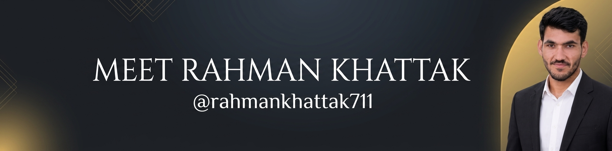

# 👋 Hi, I'm Rahman Khattak

### Full Stack Developer

I build scalable, high-performance web applications with a focus on clean architecture, exceptional user experiences, and modern cloud-native technologies. My work spans frontend and backend development, where I combine React and Next.js interfaces with TypeScript-driven APIs powered by NestJS and Node.js. I design systems that prioritize maintainability, security, and efficient data flow, using PostgreSQL for structured storage and Docker for repeatable deployment. I also invest in automation, testing, and continuous delivery so that every project stays reliable and agile in production.

  
  
  

